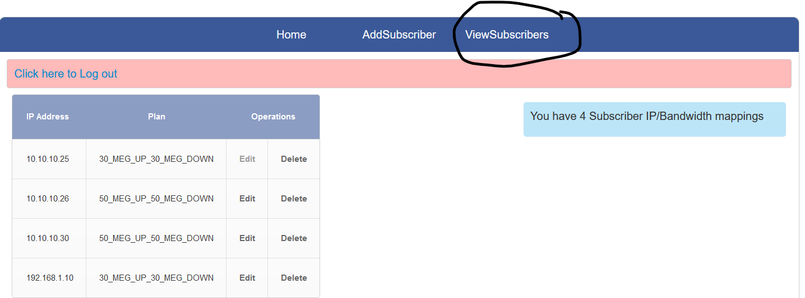
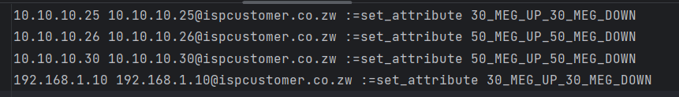
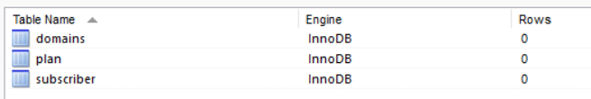
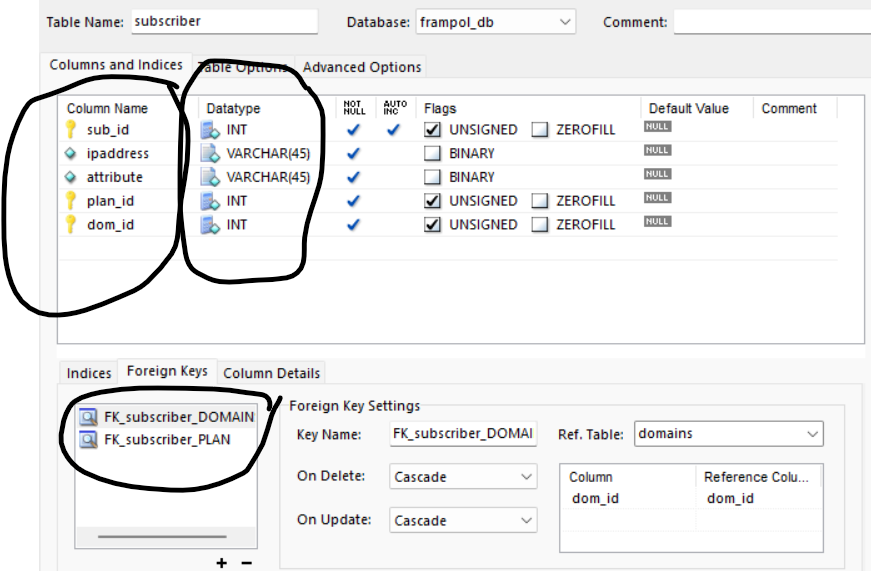
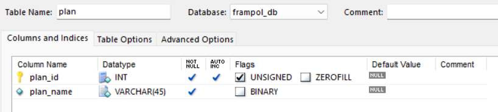
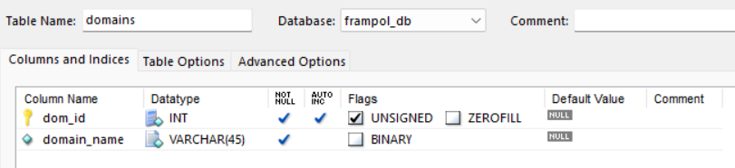
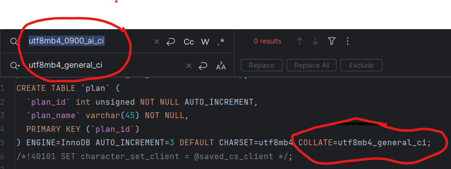
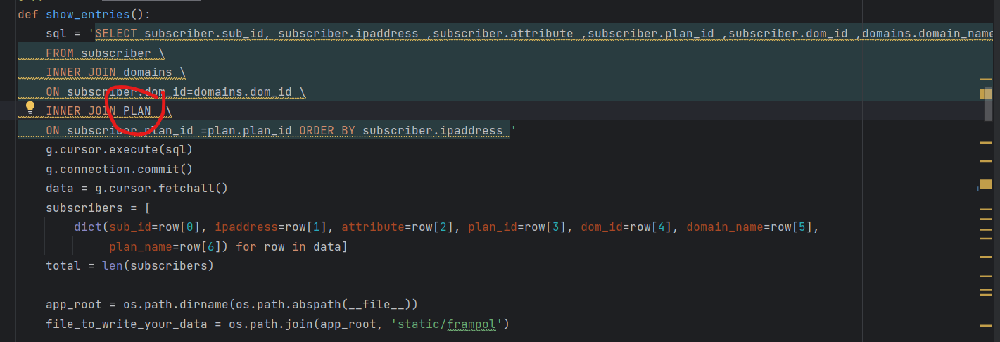
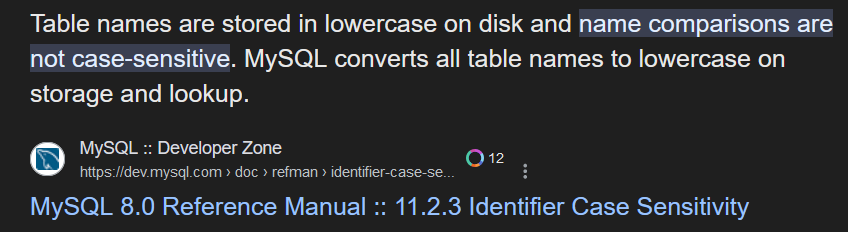
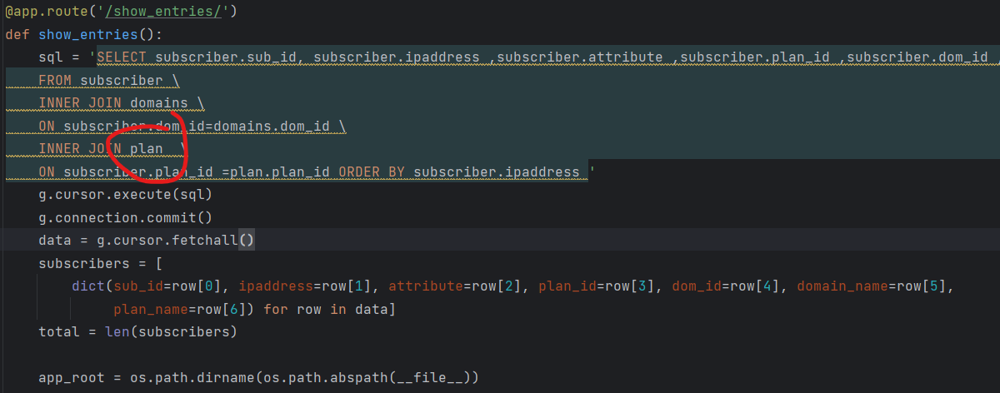

## Self service portal generating a text file format using Python, Flask & MySQL (Subscriber Network Provisioning through an Internet Bandwidth Shaper) 

The Internet Bandwidth Shaper Consumed an input txt file in this format 

```
 10.10.10.25 10.10.10.25@ispcustomer.co.zw :=set_attribute 30_MEG_UP_30_MEG_DOWN
 10.10.10.26 10.10.10.26@ispcustomer.co.zw :=set_attribute 50_MEG_UP_50_MEG_DOWN
 ```
## Installation
To run the application:
1. Clone this repository.
2. Navigate to the project directory.
3. Run `docker-compose up` to start the containers.

### Introduction
This initiative stemmed from my time as a Systems Engineer at an Internet Service Provider (ISP) in Zimbabwe, between 2015 and 2018. Faced with the challenge of managing a tier 2 internet customer's bandwidth needs, I decided to automate this process.

### About Myself
I served as a Systems Engineer during this period (2015 -2018), entrusted with managing critical business and operational support systems (BSS/OSS) running on Linux/Windows servers. My responsibilities also extended to maintaining the underlying VMware/HyperV. SAN infrastructure and automating repetitive tasks.

### The Challenge
The tier 2 customer was leasing the bandwidth internet shaper for their Internet customers. This posed a significant operational overhead as requests flooded in via email and the ticketing system's support queue, demanding constant attention.

## The Solution
Confronted with mounting operational demands, I seized the opportunity to automate the process and created a self-service portal. This self service portal empowered the tire 2 ISP to take control of their bandwidth management, reducing the support burden on our team and enhancing their experience.

#### Screenshots

##### Add Subscriber 


##### View Subscribers 



##### Output 
The Internet bandwidth shaper ingested a text file following this structure below.




##### Key Considerations of the format. 
- spaces in the file.
- fields required - ipaddress, ipaddress@domain then :=set_attribute applies the required bandiwidth.
- This output was then sent to the internet bandwidth shaper via a linux cron job. 

##### Database Structure

Database contained 3 tables.


Subscriber table with 2 foreign keys to the PLAN and DOMAINS table.



Plan table



Domains table



##### Limitations - Improvements.

I tried to document any improvements that could be made to this flask/python app. When I designed it, it was meant to streamline the network subscriber provisioning process and not meant to be a fully fledged application. There are concepts that can be borrowed for other applications.

e.g 

- validation of the input from the portal.
- Business logic checks for Data input. 
- No database validation checks 


### Key Features
- **Self-Service Interface:** Customer could manage their bandwidth allocation and configurations autonomously, eliminating the need for constant manual intervention.
- **Efficiency Through Automation:** Leveraging automation, I minimized response times and optimized resource allocation, enhancing both customer satisfaction and operational efficiency.

### Conclusion
By embracing automation and empowering the customer, I not only tackled operational challenges but also fostered stronger, more efficient relationships. 


## Dockerising the App
"I first developed this application eight years ago, when Docker was still in its early stages. However, I didn't containerize it until last year (2023), when I decided to update my knowledge of containers and Docker by converting this service into a multi-container application."

- I figured dockerising the app will make it easier for anyone out there who wants to see how it works. I will put every detail about docker that should help anyone troubleshoot whatever challenges they will face when trying to reproduce this repo.

#### DockerFile Contents/terms
For example, in your Dockerfile:
Expose 5000 

The port specified after the EXPOSE instruction in the Dockerfile would be the port inside the Docker container.

So, in the command docker run -i -t -p 6080:5000 ..., where port 5000 is mapped to port 6080, you would expose port 5000 inside the Dockerfile if your application listens on that port.

#### Docker Compose 

Lets educate each other first 

    ports:
      - 6080:5000

6080 is the port on the host machine.
5000 is the port inside the Docker container.

e.g In the command docker run -i -t -p 6080:5000, the port mapping specifies that port 5000 inside the Docker container is mapped to port 6080 on the host machine.

#### Docker multi-stage builds

When to use Docker multi-stage build?

Multi-stage builds are great when you need to create an artifact or binary. Building such requires a lot of dependencies. However, once the binary is built, you don't need the dependencies to run it.

You should consider using Docker multi-stage builds when your application has a complex build process and several dependencies or when you want to separate the build and runtime environments.

Why use Docker multi-stage build?

Here are some benefits of using Docker multi-stage build:

    Generated images are smaller. The final image is typically much smaller than the one produced by a normal build, as the resulting image includes just what the application needs to run.
    More secure containers. Packages and dependencies need to be kept up to date because they can be a potential source of vulnerability for attackers to exploit. Therefore, you should only keep the required dependencies. Using Docker multi-stage build means the resulting container will be more secure because your final image includes only what it needs to run the application.
    Faster deployment. Smaller images mean less time to transfer or quicker CI/CD builds, faster deployment time, and improved performance.


#### Docker Networking 

Docker networking is primarily used to establish communication between Docker containers and the outside world via the host machine where the Docker daemon is running.

Docker supports different types of networks, each fit for certain use cases. We’ll be exploring the network drivers supported by Docker in general.
- Docker typically uses a bridge network, and while it can support host networking, that option is only available on Linux.
- When using Docker containers, network isolation is achieved using a network namespace.

##### What Are Docker Network Drivers?

Docker handles communication between containers by creating a default bridge network, so you often don’t have to deal with networking and can instead focus on creating and running containers. This default bridge network works in most cases, but it’s not the only option you have.

Docker allows you to create three different types of network drivers out-of-the-box: bridge, host, and none. However, they may not fit every use case, so we’ll also explore user-defined networks such as overlay and macvlan. Let’s take a closer look at each one.

##### The Bridge Driver

This is the default. Whenever you start Docker, a bridge network gets created and all newly started containers will connect automatically to the default bridge network.

You can use this whenever you want your containers running in isolation to connect and communicate with each other. Since containers run in isolation, the bridge network solves the port conflict problem. Containers running in the same bridge network can communicate with each other, and Docker uses iptables on the host machine to prevent access outside of the bridge.

Let’s look at some examples of how a bridge network driver works.

 
Check the available network by running the docker network ls command
- run docker network ls  
- Start your containers. 
- Run the docker ps command to verify that containers are up and running.
- Verify that the containers are attached to the bridge network. 


The downside with the bridge driver is that it’s not recommended for production; the containers communicate via IP address instead of automatic service discovery to resolve an IP address to the container name. Every time you run a container, a different IP address gets assigned to it. It may work well for local development or CI/CD, but it’s definitely not a sustainable approach for applications running in production.

Another reason not to use it in production is that it will allow unrelated containers to communicate with each other, which could be a security risk. 

NB - You can create custom bridge networks later.

##### The Host Driver

As the name suggests, host drivers use the networking provided by the host machine. And it removes network isolation between the container and the host machine where Docker is running. For example, If you run a container that binds to port 80 and uses host networking, the container’s application is available on port 80 on the host’s IP address. You can use the host network if you don’t want to rely on Docker’s networking but instead rely on the host machine networking.

One limitation with the host driver is that it doesn’t work on Docker desktop: you need a Linux host to use it. This article focuses on Docker desktop, but I’ll show you the commands required to work with the Linux host.

The following command will start an Nginx image and listen to port 80 on the host machine:

``` docker run --rm -d --network host --name my_nginx nginx ```

You can access Nginx by hitting the http://localhost:80/ url.

The downside with the host network is that you can’t run multiple containers on the same host having the same port. Ports are shared by all containers on the host machine network.

##### The None Driver

The none network driver does not attach containers to any network. Containers do not access the external network or communicate with other containers. You can use it when you want to disable the networking on a container.

##### The Overlay Driver

The Overlay driver is for multi-host network communication, as with Docker Swarm or Kubernetes. It allows containers across the host to communicate with each other without worrying about the setup. Think of an overlay network as a distributed virtualized network that’s built on top of an existing computer network.

To create an overlay network for Docker Swarm services, use the following command:

``` docker network create -d overlay my-overlay-network ```

To create an overlay network so that standalone containers can communicate with each other, use this command:

``` docker network create -d overlay --attachable my-attachable-overlay```

##### The Macvlan Driver

This driver connects Docker containers directly to the physical host network. As per the Docker documentation:

    “Macvlan networks allow you to assign a MAC address to a container, making it appear as a physical device on your network. The Docker daemon routes traffic to containers by their MAC addresses. Using the macvlan driver is sometimes the best choice when dealing with legacy applications that expect to be directly connected to the physical network, rather than routed through the Docker host’s network stack.”

Macvlan networks are best for legacy applications that need to be modernized by containerizing them and running them on the cloud because they need to be attached to a physical network for performance reasons. A macvlan network is also not supported on Docker desktop for macOS.

##### Basic Docker Networking Commands

To see which commands list, create, connect, disconnect, inspect, or remove a Docker network, use the docker network help command.

```$ docker network help

Usage:  docker network COMMAND

Manage networks

Commands:
  connect     Connect a container to a network
  create      Create a network
  disconnect  Disconnect a container from a network
  inspect     Display detailed information on one or more networks
  ls          List networks
  prune       Remove all unused networks
  rm          Remove one or more networks
  ```

This application comprises multiple containers(multi-container app), with one running the Flask app and the other hosting a MySQL database. I've included detailed notes on container networking for those interested in understanding its functionality.

Please note that if you face problems with troubleshooting - understand these scenarios 

- container to container communications on same host.
- container to container on different hosts 
- app to app communications on the same container.


##### Running the application 
- run  docker compose up -d  - inside the project folder.

##### Deleting the environment 

- run  docker-compose down -- rmi all

##### Basic Docker Workflow

First step is to configure your docker files
      - See the Dockerfile contents under your root directory - you can test these dockerfiles separately for example the frontend dockerfile.

Second step, create an image of your application 
      -  docker build -t bandshaper/flask-app:1.0.0 .       

Third step, create a container from your image & run it
      -  docker build -t bandshaper/flask-app:1.0.0 .      

Final step - Running application.
      - Your application is now running in a container and you can make any necessary tests.

##### Here are the challenges I encountered and successfully addressed while dockerizing this application:

###### Challenge 1 

- Collation errors that made my container fail to initialise my database inside the mounted docker entrypoint - ./db:/docker-entrypoint-initdb.d/:ro 



###### Solution 

- Since I was using mysql-5.7 on my windows machine to develop this app, for some reason i decided to dockerise my db container using Mariadb-latest (bad move).

Upon investigation, I found that the latest version of MariaDB does not support the utf8mb4_0900_ai_ci Collation, as depicted in the image. Consequently, I replaced the collation with one that is supported by MariaDB, as indicated in the image above.

###### Challenge 2 

- one of my SQL queries was referencing a table name using caps. 



In all honesty this caught me offguard. I had an SQL query that was referencing the plan table in caps. Whats wierd is that I am running MySQL 5.7 on 
my windows machine and it was working perfectly fine. When I dockerised my application, I used Mariadb as my base image and I was getting this error.


I could see that it was able to see my database and able to connect to it but couldnt think that was the issue.



###### Solution 

- I changed my SQL query to lower case. 



###### Challenge 3 

- I needed my frontend app container to come with mysql-client, I needed this tool inorder to test connectivity from the app to the the database container.

###### Solution 

-In my app container, I had insert this line - in my DockerFile

```
RUN apk update && 
\ apk add mariadb-client
```

###### Biggest takeaway 

Ensure consistency in the versions of Python, Flask, and MySQL across both your development environment and Docker setup. This alignment is fundamental to Docker's purpose.


