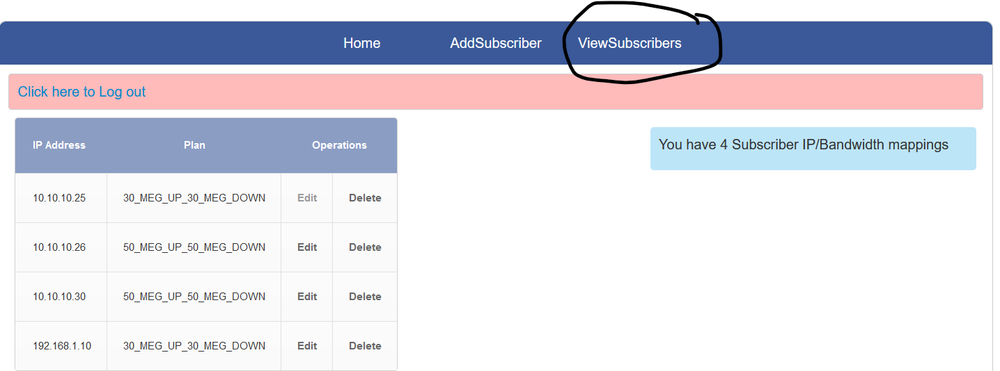
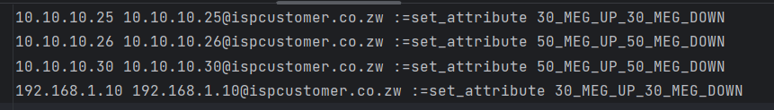
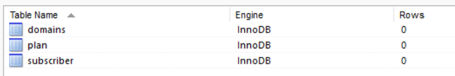
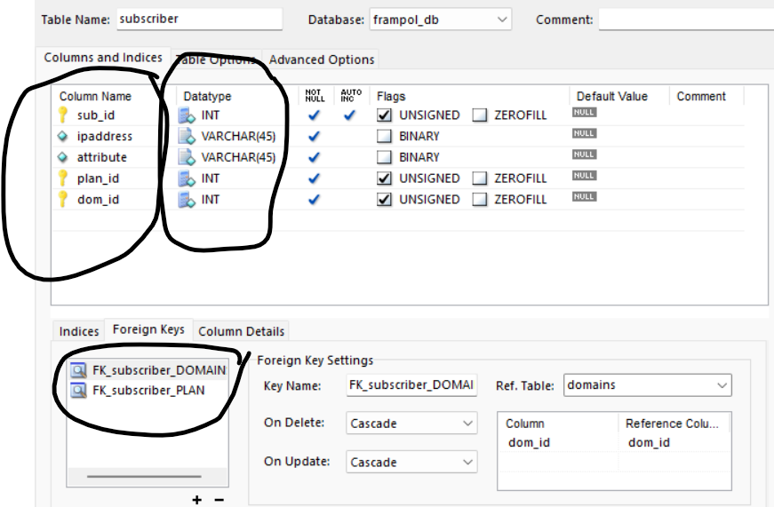
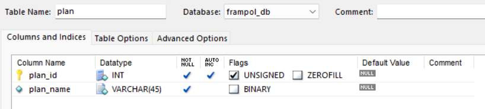
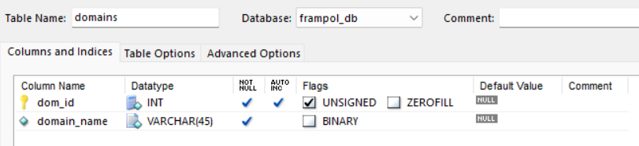

## Self-Service Portal for Internet Bandwidth Shaper (Text File Format Generated by Python)

The Internet Bandwidth Shapper Consumed an input txt file in this format 

```
 10.10.10.25 10.10.10.25@ispcustomer.co.zw :=set_attribute 30_MEG_UP_30_MEG_DOWN
 10.10.10.26 10.10.10.26@ispcustomer.co.zw :=set_attribute 50_MEG_UP_50_MEG_DOWN

 ```

## Introduction
This initiative stemmed from my time as a Systems Engineer at an Internet Service Provider (ISP) in Zimbabwe, between 2015 and 2017. Faced with the challenge of managing a tier one internet customer's bandwidth needs, I decided to automate this process.

## About Myself
I served as a Systems Engineer during this period, entrusted with managing critical business and operational support systems (BSS/OSS) running on Linux/Windows servers. My responsibilities also extended to maintaining the underlying VMware & HyperV infrastructure and automating repetitive tasks.

## The Challenge
The tier one customer was leasing the bandwidth internet shaper for their Internet customers. This posed a significant operational overhead as requests flooded in via email and the ticketing system's support queue, demanding constant attention.

## The Solution
Confronted with mounting operational demands, I seized the opportunity to automate the process and created a self-service portal. This self service portal empowered the tier 1 ISP to take control of their bandwidth management, reducing the support burden on our team and enhancing their experience.

Portal Images 

#### Add Subscriber 


#### View Subscribers 



#### Output 
The Internet bandwidth shaper ingested a text file following this structure below.




#### Key Considerations of the format. 
- spaces in the file.
- fields required - ipaddress, ipaddress@domain then :=set_attribute applies the required bandiwidth.
- This output was then sent to the internet bandwidth shaper via a linux cron job. 

#### Database Structure

Database contained 3 tables.


Subscriber table with 2 foreign keys to the PLAN and DOMAINS table.


Plan table


Domains table.


#### ToDo - Improvements.
I tried to document any improvements that could be made to this flask/python app. When I designed it, it was meant to streamline the network subscriber provisioning process and not meant to be a fully fledged application. There are concepts that can be borrowed for other applications.

e.g 

- validation of the input from the portal.
- Business logic checks for Data input.  


## Key Features
- **Self-Service Interface:** Customer could manage their bandwidth allocation and configurations autonomously, eliminating the need for constant manual intervention.
- **Efficiency Through Automation:** Leveraging automation, I minimized response times and optimized resource allocation, enhancing both customer satisfaction and operational efficiency.

## Conclusion
By embracing automation and empowering the customer, I not only tackled operational challenges but also fostered stronger, more efficient relationships. 